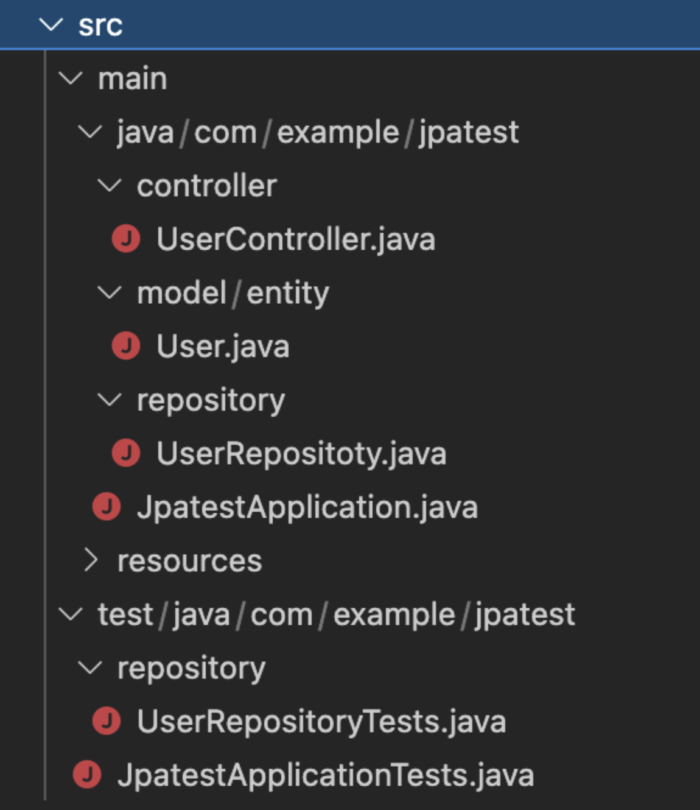

파일 구조



```java
package com.example.jpatest.controller;

import org.springframework.stereotype.Controller;

@Controller
public class UserController {
    
}
```

```java
package com.example.jpatest.model.entity;

import javax.persistence.Entity;

import lombok.Data;

@Entity
@Data
public class User {
    private Long id;
    private String account;
    private String password;
    private String name;
}
```

```java
package com.example.jpatest.repository;

import com.example.jpatest.model.entity.User;

import org.springframework.data.jpa.repository.JpaRepository;
import org.springframework.stereotype.Repository;

@Repository
public interface UserRepositoty extends JpaRepository<User, Long>{
}
```

```java
package com.example.jpatest;

import org.springframework.boot.SpringApplication;
import org.springframework.boot.autoconfigure.SpringBootApplication;
 
@SpringBootApplication
public class JpatestApplication {

	public static void main(String[] args) {
		SpringApplication.run(JpatestApplication.class, args);
	}

}
```

```java
package com.example.jpatest.repository;

import com.example.jpatest.JpatestApplicationTests;
import com.example.jpatest.model.entity.User;

import org.junit.jupiter.api.Test;
import org.springframework.beans.factory.annotation.Autowired;

public class UserRepositoryTests extends JpatestApplicationTests{
    @Autowired
    private UserRepositoty userRepositoty;

    @Test
    public void create(){
        User user = new User();

        user.setAccount("test");
        user.setPassword("test");
        user.setName("onin");

        User newUser = userRepositoty.save(user);
        System.out.print(newUser);
    }

}
```

```java
package com.example.jpatest;

import org.junit.jupiter.api.Test;
import org.springframework.boot.test.context.SpringBootTest;

@SpringBootTest
public class JpatestApplicationTests {
	@Test
	void contextLoads() {
	}

}
```